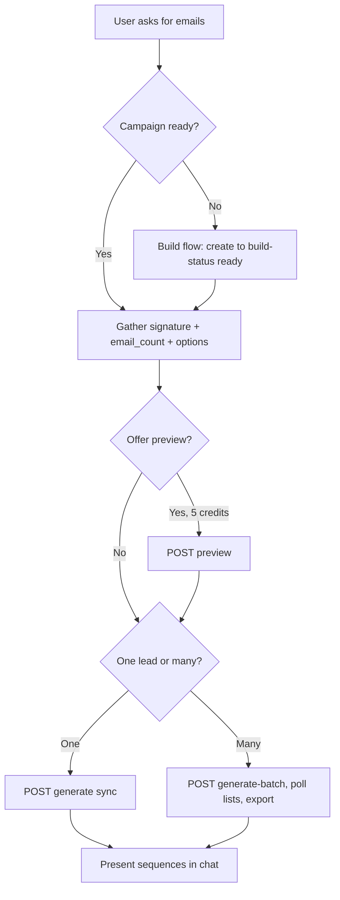

# MachFive - AI Cold Email Generator

Generate personalized cold email sequences from lead data. MachFive uses AI to research prospects and craft unique, relevant outreach - not templates.

There are two things you can do with this skill:

- **Build a campaign** (the messaging foundation: target audience, social proof, lead magnets, risk reversal, value propositions). Done once per campaign; no credits.
- **Generate emails** against a campaign - preview, single lead, or batch. This is what costs credits.

Run the build flow whenever the user asks to build/create a new campaign, or when they want to generate but have no usable campaign yet. If they already have a ready campaign and just want emails, skip straight to generating against it.

## Setup

1. Get your API key at https://app.machfive.io/settings (Integrations -> API Keys)
2. Set `MACHFIVE_API_KEY` in your environment

All requests use `Authorization: Bearer {MACHFIVE_API_KEY}` (or the `X-API-Key: {MACHFIVE_API_KEY}` header). Base URL: `https://app.machfive.io`.

## Chat-agent playbook

Follow this when a user asks for emails in a chat UI:

1. **Find the campaign first.** Call `GET /api/v1/campaigns`. If the user named one, match it; otherwise ask which to use. If they have none (or none ready), offer to build one (see "Build a campaign"). Every generate/preview call needs a campaign ID in the URL.
2. **Gather the required config conversationally before spending any credits:**
   - **Signature (required).** Call `GET /api/v1/signatures` and offer a saved one. If none fits, ask for the details and build a multi-line signature (Name / Company | Position / Company Address). Optionally save it with `POST /api/v1/signatures` for reuse. Pass it as `email_signature` (inline) or `signature_id` (saved) - exactly one.
   - **Emails per lead (required).** Ask for `email_count`, an integer **1-4**.
   - **Optional:** `approved_ctas` (offer the list below), `additional_details` (any angle/constraints for the writer), `list_name`, and the **enrichment** toggle.
3. **CTAs (`approved_ctas`).** Valid values: `Question CTA`, `Lead Magnet CTA`, `Direct Meeting CTA`, `Loom Video CTA`, `Consultation CTA`, `Educational CTA`, `Demo CTA`, `Trial CTA`. Offer them; if the user doesn't choose, omit the field and the API uses the three standard ones (`Question CTA`, `Lead Magnet CTA`, `Direct Meeting CTA`).
4. **Confirm cost before spending.** Preview = 5 credits; generate = 1 credit/lead (2/lead with enrichment). State the cost and get a go-ahead.
5. **Offer a preview before a batch.** Ask if they want to see sample output first (costs 5 credits). Only run it if they agree.
6. **Run, then handle async (read "Async jobs & polling" below).** Single generate returns the sequence directly (slow - see timeouts). Batch returns immediately; drive it to completion using one of the strategies in that section (poll in-turn, schedule a background follow-up, and/or set `notification_email`), then export and present results readably (subject + body per step). Don't check once and go silent.
7. **After a build, proactively offer to generate.** Once value propositions are selected (build kicked off), don't stop - offer to generate emails next (you can generate as soon as VPs are selected, even while `overall` is still `building`).



## Async jobs & polling (important for chat agents)

Several steps are asynchronous and return `202` with an id whose status changes over time: target-audience research, value-proposition generation, the campaign build, and **generate-batch**. Chat agents (Slack, etc.) consistently mishandle these, so follow these rules exactly:

**Default approach: run ONE self-terminating poll loop, not repeated manual checks.** The reliable pattern is a single shell command that loops until the status is terminal and then exits - so you physically can't "check once and forget to continue." Issuing separate one-off status calls across steps is what makes agents go silent; don't do that.

**Do not depend on `jq` (or any optional tool) to detect completion.** `jq` is often absent in agent environments (OpenClaw's default sandbox image ships without it, and sandboxes usually have no network to `apt-get` it). Detect the terminal state by `grep`-ing the **raw** response for the stable status field - that needs only `curl` + `grep`. If a tool the loop relies on is missing, the loop can run forever and print nothing, which is exactly the "it went silent" failure. The loops below are jq-free on purpose.

```bash
# Poll a batch list until it finishes, then stop. curl + grep only (no jq needed).
# MF_BASE=https://app.machfive.io, MF_KEY=API key.
LIST_ID="<list_id>"; while true; do
  S=$(curl -s "$MF_BASE/api/v1/lists/$LIST_ID" -H "Authorization: Bearer $MF_KEY")
  echo "$S" | grep -oE '"processing_status":"[a-z_]+"' || echo "$S"   # show status; dump raw if unexpected
  echo "$S" | grep -qE '"processing_status":"(completed|failed)"' && break
  sleep 20
done
```

The same loop works for build steps - just swap the endpoint and the terminal value (and always include the failure value so it can't spin forever). For a build:

```bash
# Poll campaign build until ready (or failed), then stop. curl + grep only (no jq needed).
CID="<campaign_id>"; while true; do
  S=$(curl -s "$MF_BASE/api/v1/campaigns/$CID/build-status" -H "Authorization: Bearer $MF_KEY")
  echo "$S" | grep -oE '"overall":"[a-z]+"' || echo "$S"   # show status; dump raw if unexpected
  echo "$S" | grep -qE '"overall":"(ready|failed)"' && break
  sleep 15
done
```

For a single job (target-audience or value-proposition generation), poll `GET /api/v1/jobs/<id>` and break on `"status":"(completed|failed)"` (same `grep` approach, no jq). Note: build polling has no email fallback - `notification_email` (option C below) only applies to **generate-batch**, not to building a campaign.

If you genuinely need parsed fields, `jq` is optional and must be guarded so its absence can't break the loop - e.g. `command -v jq >/dev/null && echo "$S" | jq -c '{processing_status,leads_count}'`, or use the always-present `python3` (`echo "$S" | python3 -c 'import sys,json;d=json.load(sys.stdin);print(d.get("processing_status"))'`). But never make the terminal-state check depend on it - keep that on `grep` of the raw body.

Pick where to run that loop based on how long it'll take:

- **(A) Foreground - short waits** (VP generation ~2-3 min, build a few min, tiny batches). Run the loop in the foreground; the turn blocks until it exits, then export and present results in that same reply. Note your shell tool's own timeout (on OpenClaw, `tools.exec.timeoutSec`, default 30 min, and it may auto-background after ~10s) - if the wait could exceed it, use (B).
- **(B) Background + notify-on-exit - long waits** (larger batches, enrichment on). Run the **same loop as a background process** so the runtime wakes you when it exits, then export and post to the channel. On **OpenClaw**, background `exec` does this automatically (`tools.exec.notifyOnExit` is on by default: it emits a system event + heartbeat when the command exits). `sessions_spawn` (announce-on-completion) or a cron re-check also work. Tell the user you've started it and will message them when it's done - because here you actually will.
- **(C) `notification_email` on the batch - channel-independent fallback.** Good default even alongside (A)/(B): MachFive emails the user (or the workspace owner) when the batch finishes, regardless of what the conversation is doing. Ask for an address or note it defaults to the workspace owner.

Invariants, whichever you pick:

- **Never report status from memory - always do a fresh `GET` first.** A job you last saw as `processing` may already be `completed`. Whenever you state a status (especially when the user asks "is it done?"), make a new status call immediately before answering, and report exactly what that call returns.
- **Only promise a notification you actually set up.** You can't passively "wait" between messages. Say "I'll message you when it's done" only if a loop is running now (A), you backgrounded it with notify-on-exit / scheduled a follow-up (B), or `notification_email` is set (C). Otherwise say so plainly and tell the user to ask for an update.
- **Never trust a silent loop - confirm it's actually working.** A background loop that prints nothing is usually broken (a missing tool like `jq`, a bad var, or no network), not "still processing." After starting one, verify it emitted at least one status line; if it's silent, run a one-off `curl ... | grep` status check by hand. Don't wait indefinitely on a loop you haven't confirmed is alive.
- **If a tool the loop needs is missing and can't be installed** (sandboxes often have no network), don't get stuck: fall back to the jq-free `grep` loop, read the raw `curl` JSON yourself (you're an LLM - you don't need `jq` to see the status), or set `notification_email` (C) and tell the user.
- **One loop per job - don't spawn overlapping loops or pile on manual checks.** Start a single poll loop for a given id and let it run to its terminal state; don't launch a second background loop or repeatedly fire one-off `curl`s for the same job while one is already running (it's wasteful and noisy). Also avoid leading-`sleep` one-offs like `sleep 20 && curl ...` - some runtimes block those as rate-limit workarounds; keep the `sleep` inside the loop body.
- **You can keep working while async runs.** Generation can start as soon as value propositions are selected, so you don't have to block on `overall: "ready"` before offering the next step.

## Build a campaign (only if needed)

Build a campaign the same way the in-app wizard does: create a shell, submit a target audience, choose assets, generate value propositions, then kick the build. Each step is its own call so you can keep a human in the loop. **No credits are charged for building** (builds are limited by your plan's campaign-build limit). The expensive AI stages run asynchronously - poll a job or the derived build status.

Order: `create -> target-audience -> (social_proof, lead_magnet, risk_reversal) -> value_proposition/generate -> value_proposition/selection -> poll build-status`.

### 1. Create the campaign shell

```
POST https://app.machfive.io/api/v1/campaigns
Content-Type: application/json

{ "name": "Q3 Outbound - Fintech CFOs" }
```

**Response (201):** `{ "id": "b3f...", "name": "...", "status": "draft" }`

Fails fast with **409 NOT_READY** if the workspace isn't ready to build - `detail.missing` lists which of `company_summary`, `company_documents`, `target_audiences` are missing. Those come from onboarding / market research, which is done in the app UI; point the user there if they're not ready. **403** if the plan's campaign-build limit is reached.

### 2. Submit the target audience

List the workspace's saved segments, then submit the user's pick (or define a custom one).

```
GET  https://app.machfive.io/api/v1/target-audiences
```
**Response (200):** `{ "data": [ { "id", "segment_name", "industry_vertical", ... } ], "has_more": false, "total": N }`. Supports `?q=`, `?limit=`, `?offset=`.

```
POST https://app.machfive.io/api/v1/campaigns/{campaign_id}/target-audience
Content-Type: application/json

{ "target_audience": { "id": "ta_123", "segment_name": "Fintech CFOs" } }
```

Or define a custom segment:
```json
{
  "is_custom_target_audience": true,
  "target_audience": {
    "segment_name": "Fintech CFOs",
    "industry_vertical": "Financial Services",
    "company_size": "200-1000",
    "annual_revenue": "$50M-$250M",
    "geographic_location": "North America",
    "decision_makers": ["CFO", "VP Finance"],
    "additional_details": "Series B+, scaling finance ops"
  }
}
```
`target_audience.id` is required unless `is_custom_target_audience` is `true`.

**Response (202):** `{ "id": "job_...", "type": "campaign.target_audience", "status": "processing", "target_audience_id": "ta_123" }`. This kicks background research; poll `GET /api/v1/jobs/{id}` or watch build-status. The next steps (social proof, lead magnet, risk reversal) don't depend on it and can be submitted right away.

### 3. Social proof, lead magnet, risk reversal

Each of these three steps uses the same list-then-submit pattern. Read options, then submit the selection.

```
GET https://app.machfive.io/api/v1/campaigns/{campaign_id}/assets/{type}/options
```
`{type}` is one of `social_proof`, `lead_magnet`, `risk_reversal`. **Response:** `{ "asset_type": "social_proof", "ready": true, "options": [ { "id": "sp_001", "name": "...", "description": "...", "type": "..." } ] }`. If `ready` is `false`, poll again. Options can be an **empty array** (common for `risk_reversal`).

```
PUT https://app.machfive.io/api/v1/campaigns/{campaign_id}/assets/{type}/selection
Content-Type: application/json

{
  "selected_ids": ["sp_001", "sp_004"],
  "edited_names": { "sp_001": "200+ fintechs onboarded in 18 months" },
  "edited_descriptions": {},
  "additional_details": "Lead with the onboarding-speed angle"
}
```

**Response (200):** `{ "asset_type": "social_proof", "items_stored": 2 }`.

The selection body is the same for **every** asset type (including `value_proposition`):
- `selected_ids` accepts an **empty array** `[]` - so any step can be submitted free-text-only or effectively skipped.
- `additional_details` (free-text guidance) is accepted on **all** types, not just risk reversal.
- `edited_names` / `edited_descriptions` are accepted on all types.

Example free-text-only risk reversal: `{ "selected_ids": [], "additional_details": "30-day sell-through guarantee: ..." }`.

### 4. Value propositions (generate, then select - kicks the build)

VPs are the only asset generated on demand, and they require social proof, lead magnet, and risk reversal to be submitted first.

```
POST https://app.machfive.io/api/v1/campaigns/{campaign_id}/assets/value_proposition/generate
```
**Response (202):** `{ "id": "job_...", "type": "campaign.value_propositions", "status": "processing" }`. **409 NOT_READY** (with `detail.missing`) if SP/LM/RR aren't all submitted. Poll `GET /api/v1/jobs/{id}` in a loop until `completed` (see "Async jobs & polling" - keep polling within the turn; always re-fetch before reporting), then read options:

```
GET https://app.machfive.io/api/v1/campaigns/{campaign_id}/assets/value_proposition/options
```
Poll until `ready: true`, then submit your picks:

```
PUT https://app.machfive.io/api/v1/campaigns/{campaign_id}/assets/value_proposition/selection
Content-Type: application/json

{ "selected_ids": ["vp_001", "vp_002"] }
```
**Response (202):** `{ "asset_type": "value_proposition", "items_stored": 2, "job": { "id": "job_...", "type": "campaign.build", "status": "processing" } }`. Submitting VPs kicks the post-wizard build (all background, no further input). Submitting `[]` still kicks the build, but normally pick at least one.

### 5. Poll build status

```
GET https://app.machfive.io/api/v1/campaigns/{campaign_id}/build-status
```
**Response:** `{ "campaign_id", "overall": "draft|building|ready|failed", "stages": { "target_audience", "social_proof", "lead_magnet", "risk_reversal", "value_proposition" } }`. Poll in a loop every 15-30s until `overall` is `ready` (see "Async jobs & polling" - poll within the turn and always re-fetch before reporting). The campaign is ready for email generation at that point. You don't have to wait for `ready` to offer generation - it's available as soon as VPs are selected.

You can review everything with `GET /api/v1/campaigns/{campaign_id}/selections` (returns the target audience plus each asset's selected items + additional_details).

> **Generation can start as soon as value propositions are selected** - you don't have to wait for `overall: "ready"`. Batches submitted while the build is still `building` are accepted and queue until it finishes.

## Configuration (options)

These `options` apply to **preview**, **generate** (single), and **generate-batch**.

| Option | Type | Required | Description |
|--------|------|----------|-------------|
| `email_count` | number | **Yes** | Emails per lead. Integer **1-4**. |
| `email_signature` | string | Yes* | Sender signature, inline. Multi-line via `\n`. Required unless `signature_id` is given. |
| `signature_id` | string (UUID) | Yes* | A saved signature (from `GET /api/v1/signatures`) to use instead of `email_signature`. |
| `additional_details` | string | No | Free-text campaign context for the writer (angle, constraints, instructions). |
| `list_name` | string | No | Display name for the list in the MachFive UI. |
| `approved_ctas` | string[] or string | No | CTAs to use. Defaults to `Question CTA, Lead Magnet CTA, Direct Meeting CTA`. Valid values: Question, Lead Magnet, Direct Meeting, Loom Video, Consultation, Educational, Demo, Trial (each suffixed with " CTA"). |
| `enrichment_enabled` | boolean | No | Run web research per lead before writing. Costs 2 credits/lead instead of 1. See enrichment note below. |
| `notification_email` | string | No | **(batch only)** Where to email the "processing complete" notification. Defaults to the workspace owner. |

\* A signature is **required**: provide exactly one of `email_signature` or `signature_id` (both is a 400; neither is a 400). `campaign_angle` is a deprecated alias of `additional_details`; `sequence_name` is a deprecated alias of `list_name`.

### Signature format

The signature is required so the writer never fabricates sender details. Send it as one string with `\n` line breaks; each line renders on its own line. Best-practice structure:

```
Name
Company Name | Position
Company Address
```

As JSON: `"email_signature": "Jane Doe\nAcme Inc | VP Marketing\n123 Main St, Springfield, IL 62701"`.

### Enrichment

- On **real runs** (`generate` and `generate-batch`), enrichment does live web research, so **every lead must include at least one of** `company`, `linkedin_url`, or `company_website`. A `company` also lets the system extract the email domain and cross-reference it. A lead with none of these returns a 400.
- In **preview**, enrichment is **simulated** on synthetic leads, so the `enrichment_enabled` toggle alone changes the output (no per-lead data needed). Run a preview with it `true` and `false` to compare.

## Signatures

Reusable, workspace-scoped. Use these to offer a saved signature or to save one the user dictates.

```
GET  https://app.machfive.io/api/v1/signatures            (scope signatures:read)
POST https://app.machfive.io/api/v1/signatures            (scope signatures:write)
```
List response: `{ "data": [ { "id", "signature_text", "signature_name", "created_at", ... } ], "has_more", "total" }`. `signature_name` is auto-derived from the first line.

Create body: `{ "signature_text": "Jane Doe\nAcme Inc | VP Marketing\njane@acme.com" }` -> **201** with the created signature (use its `id` as `signature_id`).

## Preview (optional, 5 credits)

Preview a campaign against 5 synthetic leads that match its ICP, using the same engine as a real run - a faithful pre-flight before spending credits on a full batch. **Costs 5 credits** (refunded for any synthetic leads that fail; fully refunded if all fail).

```
POST https://app.machfive.io/api/v1/campaigns/{campaign_id}/preview
Content-Type: application/json

{
  "sample": {
    "headers": ["First Name", "Company Name", "Title", "Email"],
    "rows": [["Jane", "Acme Inc", "VP Marketing", "jane@acme.com"]],
    "field_mapping": { "email": "Email", "firstName": "First Name", "companyName": "Company Name" }
  },
  "options": {
    "email_count": 3,
    "email_signature": "Jane Doe\nAcme Inc | VP Marketing\n123 Main St, Springfield, IL 62701"
  }
}
```

Same required config as a real run (`email_count` 1-4 + a signature). Set `enrichment_enabled` to preview enriched vs. non-enriched output (simulated; no per-lead data required). **Response (200):** `{ "preview_id", "status": "success|partial", "credits_charged", "success_count", "fail_count", "headers", "rows", "synthetic_leads", "generated_emails" }`. Returns **409 NOT_READY** if email instructions aren't built yet (retry shortly; no charge).

## Single lead (sync)

Generate a sequence for one lead. Waits for completion and returns the sequence directly. **Can take 3-10 minutes** (AI research + generation) - use a client timeout of at least **300s**, preferably **600s**. Do not use a 120s timeout.

```
POST https://app.machfive.io/api/v1/campaigns/{campaign_id}/generate
Content-Type: application/json

{
  "lead": {
    "name": "John Smith",
    "title": "VP of Marketing",
    "company": "Acme Corp",
    "email": "john@acme.com",
    "company_website": "https://acme.com",
    "linkedin_url": "https://linkedin.com/in/johnsmith"
  },
  "options": {
    "email_count": 3,
    "email_signature": "Your Name\nYour Co | Founder\n123 Main St, City, ST",
    "approved_ctas": ["Direct Meeting CTA", "Lead Magnet CTA"]
  }
}
```

**Response (200):** `{ "lead_id", "list_id", "sequence": [ { "step": 1, "subject": "...", "body": "..." } ], "credits_remaining" }`.

**Recovery:** if the request times out, you can still get the result via `list_id`: `GET /api/v1/lists/{list_id}` to confirm status, then `GET /api/v1/lists/{list_id}/export?format=json`.

## Batch (async)

Generate sequences for multiple leads (one list). **Returns immediately (202)**; processing runs in the background.

```
POST https://app.machfive.io/api/v1/campaigns/{campaign_id}/generate-batch
Content-Type: application/json

{
  "leads": [
    { "name": "John Smith", "email": "john@acme.com", "company": "Acme Corp", "title": "VP Marketing" },
    { "name": "Jane Doe", "email": "jane@beta.com", "company": "Beta Inc", "title": "Director Sales" }
  ],
  "options": {
    "email_count": 3,
    "email_signature": "Your Name\nYour Co | Founder\n123 Main St, City, ST",
    "list_name": "Q1 Outreach Batch",
    "notification_email": "ops@yourcompany.com"
  }
}
```

Each lead must include a valid `email`. **Response (202):** `{ "list_id", "status": "processing", "leads_count": 2, "message": "..." }`.

**Flow:** POST generate-batch -> 202 + `list_id` -> poll `GET /api/v1/lists/{list_id}` in a loop until `processing_status` is `completed` (or `failed`) -> `GET /api/v1/lists/{list_id}/export?format=csv|json` -> present to the user.

Follow the "Async jobs & polling" rules: drive it to completion (poll in-turn, schedule a background follow-up via your runtime, and/or set `notification_email`) rather than checking once and going quiet; always do a fresh `GET` before telling the user whether it's done (a `processing` you saw earlier may now be `completed`); and only promise to notify later if you actually scheduled it. Setting `notification_email` is a reliable fallback - MachFive emails the user on completion regardless of what the conversation is doing.

## Lists & export

```
GET https://app.machfive.io/api/v1/lists
GET https://app.machfive.io/api/v1/lists?campaign_id={id}&status=completed&limit=20
```
**Response:** `{ "lists": [ { "id", "campaign_id", "custom_name", "processing_status", "created_at", "completed_at" } ] }` (newest first). `status` filter: `pending|processing|completed|failed`. `limit` default 50, max 100; `offset` for paging.

```
GET https://app.machfive.io/api/v1/lists/{list_id}
```
**Response:** `id`, `campaign_id`, `custom_name`, `processing_status` (`pending|processing|completed|failed`), `created_at`, `updated_at`; when `completed` also `leads_count`, `emails_created`, `completed_at`; when `failed`, `failed_at`. Poll every 10-30s. If `failed`, the list can't be exported - submit a new batch.

```
GET https://app.machfive.io/api/v1/lists/{list_id}/export?format=csv
GET https://app.machfive.io/api/v1/lists/{list_id}/export?format=json
```
- **csv** (default): the processed CSV (same as the UI download).
- **json**: `{ "leads": [ { "email", "name?", "company?", "title?", "sequence": [ { "step", "subject", "body" } ] } ] }`.
- **409** if the list isn't completed yet (poll first). **404** if not found.

## Lead fields

Each lead must include a valid **`email`** (used to map the lead through processing and back to its sequence in exports). All other fields are optional but improve personalization - and at least one of `company`, `linkedin_url`, or `company_website` is **required per lead when `enrichment_enabled` is true**.

| Field | Required | Description |
|-------|----------|-------------|
| `email` | **Yes** | Lead's email; maps the lead through processing and in exports |
| `name` | No | Full or first name (improves personalization) |
| `company` | No | Company name (improves personalization; enables enrichment domain cross-reference) |
| `title` | No | Job title |
| `company_website` | No | Company URL for research / enrichment |
| `linkedin_url` | No | LinkedIn profile for deeper personalization / enrichment |

## Credits & limits

- **Building a campaign:** free (limited by your plan's campaign-build limit).
- **Preview:** flat **5 credits** per call (with refunds for failed synthetic leads). Enrichment does not add credits in preview.
- **Generate (single/batch):** **1 credit per lead**, or **2 per lead** with `enrichment_enabled`.
- **Single (sync):** can take 3-10 min; use a 300-600s client timeout.
- **Batch (async):** returns 202; poll the list. Workspaces have a concurrent-batch limit; on **429** retry later.

## Errors

| Code | Error | Description |
|------|-------|-------------|
| 400 | BAD_REQUEST | Invalid JSON; missing `lead`/`leads` or invalid `email`; `email_count` missing or not 1-4; no signature (neither `email_signature` nor `signature_id`) or both; an invalid `notification_email`; `enrichment_enabled` with a lead missing all of company/linkedin_url/company_website; or campaign setup incomplete (build not finished). |
| 401 | UNAUTHORIZED | Invalid or missing API key. |
| 402 | INSUFFICIENT_CREDITS | Not enough credits (`detail` includes required/available/payg_enabled/pct_of_cap). |
| 403 | FORBIDDEN | Campaign not in your workspace, missing scope, or campaign-build limit reached. |
| 404 | NOT_FOUND | Campaign or list doesn't exist, or `signature_id` not found in this workspace. |
| 409 | NOT_READY | Build step precondition not met (e.g. VP generate before SP/LM/RR), preview before email instructions are built, or export before the list is completed - poll/retry. |
| 429 | RATE_LIMITED / WORKSPACE_LIMIT | Rate limit, or too many concurrent batch jobs; retry later (honor `Retry-After`). |

Error body: `{ "error": "CODE", "message": "...", "detail"?: ..., "request_id": "..." }`.

## Usage examples

- "Build me a campaign for fintech CFOs" -> run the build flow (target audience -> assets -> value propositions -> poll build-status).
- "Generate a cold email for the VP of Sales at Stripe" -> gather signature + email_count, then single generate.
- "Create outreach sequences for these 25 leads" -> gather config, offer a preview, then batch -> poll -> export.
- "Show me what it'll look like with and without enrichment" -> run preview twice (`enrichment_enabled` true/false).

## Pricing

- Free: 100 credits/month
- Solo: 300 credits/month
- Starter: 2,000 credits/month
- Growth: 5,000 credits/month
- Enterprise: Custom credits/month
- 1 credit = 1 lead with a full personalized email sequence

Get started: https://machfive.io
